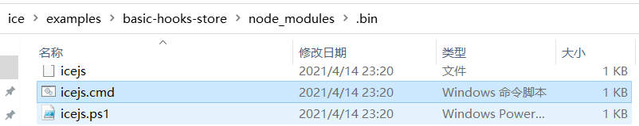

## npm start 发生了什么？

**首先，npm start 会被翻译成 icejs start --mode local**

```json
  "scripts": {
    "start": "icejs start --mode local",
    "build": "icejs build"
  },
```

icejs 这个命令怎么来的呢？

原因是 node_modules/.bin。

例如，ice 里面的一个 example：



这个 node_modules/.bin 是怎么来的呢？

当用户安装带有 `bin` 字段的包时：

- 如果是全局安装，`npm` 将会使用符号链接把这些文件链接到`/usr/local/node_modules/.bin/`；
- 如果是本地安装，会链接到`./node_modules/.bin/`。

看一下 ice/packages/icejs 它的 package.json，里面有一个 bin 字段，它的作用就是注册这个命令：

```json
{
  "bin": {
    "icejs": "./bin/ice-cli.js"
  },
}
```

显然，这是执行了 bin 目录下面的 ice-cli.js，我们打开这个 ice-cli，发现里面有十行代码：

```javascript
#!/usr/bin/env node
const utils = require('create-cli-utils');
const getBuiltInPlugins = require('../lib/getBuiltInPlugins');
const packageInfo = require('../package.json');

const forkChildProcessPath = require.resolve('./child-process-start');

(async () => {
  await utils.createCli(getBuiltInPlugins, forkChildProcessPath, packageInfo);
})();

```

第一行这个“#”注释是非常重要的：

- 当需要 `node` 环境时就需要加上 `node` 前缀。
- 如果加上 `node` 前缀，就需要指定 `icejs` 的路径 -> `node_modules/.bin`，否则 `node icejs`会去查找当前路径下的 `ice.js`，这样肯定是不对的。

这行命令的作用是告诉系统用 `node` 解析，这样命令就可以简写成 `icejs` 了。

这个 js 文件现在就是执行了一个函数

根据这个接下来的内容就是针对 utils.createCli、getBuiltInPlugin、forkChildProcessPath 来进行分析了。

## utils.createCli

来到 create-cli-utils 这个包，createCli一共 72 行代码，但是为了理解 npm start 发生了什么这条主干，我把其他不相关的代码先删掉，留下 start 相关的。

```javascript
#!/usr/bin/env node
const program = require('commander');
const start = require('./start');

module.exports = async (getBuiltInPlugins, forkChildProcessPath, packageInfo, extendCli) => {

  program
    .command('start')
    .description('start server')
    .allowUnknownOption()
    .option('--config <config>', 'use custom config')
    .option('-h, --host <host>', 'dev server host', '0.0.0.0')
    .option('-p, --port <port>', 'dev server port')
    .action(async function() {
      await start(getBuiltInPlugins, forkChildProcessPath);
    });
    
};

```

对于 icejs start --mode local

**里面没看见 --mode local 相关的内容，这个是怎么来的，留个坑。**

## 现在先开始分析 start 这个函数

start 这个函数一共 95 行代码，我们先来看一下它最顶层的函数：

```javascript
#!/usr/bin/env node
const { fork } = require('child_process');
const parse = require('yargs-parser');
const chokidar = require('chokidar');
const detect = require('detect-port');
const path = require('path');
const log = require('@alib/build-scripts/lib/utils/log');


module.exports = (getBuiltInPlugins, forkChildProcessPath) => {
  restartProcess(forkChildProcessPath);

  const watcher = chokidar.watch(configPath, {
    ignoreInitial: true,
  });

  watcher.on('change', function() {
    console.log('\n');
    log.info('build.json has been changed');
    log.info('restart dev server');
    // add process env for mark restart dev process
    process.env.RESTART_DEV = true;
    child.kill();
    restartProcess(forkChildProcessPath);
  });

  watcher.on('error', error => {
    log.error('fail to watch file', error);
    process.exit(1);
  });
};

```

**start 函数里面并没有用到 getBuiltInPlugins，提出个问题，这个参数有存在的必要吗？**

start 函数总的来说就是执行了一个 restartProcess(forkChildProcessPath)，以及创建了一个 watcher 对象并 watch.on "change" 和 "error"。这里面涉及到 restartProcess 这个函数、ice/packages/icejs/bin/child-process-start.js 里边的立即执行函数和 watch 对象的来源 chokidar 这个 npm 包。

现在我们来依次分析它们：

### restartProcess(forkChildProcessPath)

```javascript
function restartProcess(forkChildProcessPath) {
  (async () => {
    // remove the inspect related argv when passing to child process to avoid port-in-use error
    const argv = await modifyInspectArgv(process.execArgv, rawArgv);
    const nProcessArgv = process.argv.slice(2).filter((arg) => arg.indexOf('--inspect') === -1);
    child = fork(forkChildProcessPath, nProcessArgv, { execArgv: argv });
    child.on('message', data => {
      if (data && data.type === 'RESTART_DEV') {
        child.kill();
        restartProcess(forkChildProcessPath);
      }
      if (process.send) {
        process.send(data);
      }
    });

    child.on('exit', code => {
      if (code) {
        process.exit(code);
      }
    });
  })();
}
```

注释写的意思是

- 为了避免”端口正在使用“错误
- 通过删除 “inspect” 相关的参数
- 在传递给子进程时

**可以提出问题：inspect 相关的参数是什么，有哪些？子进程是哪一个进程？传递什么给子进程？**

restartProcess 出现了 modifyInspectArgv 函数、process.argv、fork 函数

#### 首先我们来看 modifyInspectArgv

```javascript
async function modifyInspectArgv(execArgv, processArgv) {
  /**
   * Enable debugger by exec argv, eg. node --inspect node_modules/.bin/build-scripts start
   * By this way, there will be two inspector, because start.js is run as a child process.
   * So need to handle the conflict of port.
   */
  const result = await Promise.all(
    execArgv.map(async item => {
      const matchResult = inspectRegExp.exec(item);
      if (!matchResult) {
        return item;
      }
      // eslint-disable-next-line
      const [_, command, ip, port = 9229] = matchResult;
      const nPort = +port;
      const newPort = await detect(nPort);
      return `--${command}=${ip ? `${ip}:` : ''}${newPort}`;
    })
  );

  /**
   * Enable debugger by process argv, eg. npm run start --inspect
   * Need to change it as an exec argv.
   */
  if (processArgv.inspect) {
    const matchResult = /(?:([^:]+):)?(\d+)/.exec(rawArgv.inspect);
    // eslint-disable-next-line
    const [_, ip, port = 9229] = matchResult || [];
    const newPort = await detect(port);
    result.push(`--inspect-brk=${ip ? `${ip}:` : ''}${newPort}`);
  }

  return result;
}
```

现在眼睛里面是两段注释和两端代码。

先看第一段注释：

- 能通过 exec argv 来 debugger：如 node --inspect node_modules/.bin/build-scripts start，顺便说一下，这里会有两个监视器，因为 start.js 会作为一个子进程运行

第二段注释：

- 能通过 process argv 来 debugger：如 eg. npm run start --inspect。需要去把它 变成一个 exec argv

--inspect 用来调试 Node.js 程序和脚本，具体怎么做的不去深入了

**先来理解下 execArgv, processArgv 这两个参数。**

它们分别是 process.execArgv 和 parse(process.argv.slice(2)) 的结果。

它们都返回当 Node.js 进程被启动时，Node.js 特定的命令行选项。

例如：

```shell
node --harmony script.js --version
```

`process.execArgv` 的结果:

```js
['--harmony']
```

`process.argv` 的结果:

```js
['/usr/local/bin/node', 'script.js', '--version']
```

所以 modifyInspectArgv 就是返回一个修饰后的argv

#### fork(forkChildProcessPath, nProcessArgv, { execArgv: argv })

**fork 函数，来自于 `child_process`这个 Node 内置的包。**

- 第一个参数 forkChildProcessPath 表明要在子进程中运行的模块（ice/packages/icejs/bin/child-process-start.js），就是utils.childProcessStart(getBuiltInPlugin)
- 第二个参数是字符串参数的列表
- 第三个参数选项 execArgv 传给可执行文件的字符串参数的列表
- 返回 ChildProcess 类

**看一下这个 child 进程启动了什么**

找到 child-process-start.js

```javascript
#!/usr/bin/env node
const utils = require('create-cli-utils');
const getBuiltInPlugins = require('../lib/getBuiltInPlugins');

(async() => {
  await utils.childProcessStart(getBuiltInPlugins);
})();
```

再找到 childProcessStart，本来有 55 行代码，去掉端口判断相关的，我这里只保留了 devServer 相关的代码：

```javascript
#!/usr/bin/env node
const detect = require('detect-port');
const inquirer = require('inquirer');
const parse = require('yargs-parser');
const { start } = require('@alib/build-scripts');
const log = require('@alib/build-scripts/lib/utils/log');

const rawArgv = parse(process.argv.slice(2), {
  configuration: { 'strip-dashed': true }
});

module.exports = async (getBuiltInPlugins) => {
  process.env.NODE_ENV = 'development';
  rawArgv.port = parseInt(newPort, 10);

  // ignore _ in rawArgv
  delete rawArgv._;
  try {
    const devServer = await start({
      args: { ...rawArgv },
      getBuiltInPlugins
    });

    ['SIGINT', 'SIGTERM'].forEach(function(sig) {
      process.on(sig, function() {
        devServer.close();
        process.exit(0);
      });
    });
  } catch (err) {
    log.error(err.message);
    console.error(err);
    process.exit(1);
  }
};

```

按照程序的执行顺序，现在我们应该看一下 @alib/build-scripts 的 start 的代码，这里面是 139 行代码，是它启动了 devServer，但涉及到 683 行的 Context 代码，明天开一篇新的来专门研究下。

关于 SIGINT 和 SIGTERM：当 Node.js 进程接收到信号时，则会触发信号事件。

- `'SIGINT'` 从终端运行时，所有平台上都支持，通常可以使用 Ctrl+C（但是这是可以配置的）触发。 当启用[终端的原始模式](http://nodejs.cn/api/tty.html#tty_readstream_setrawmode_mode)时，则使用 Ctrl+C 不会触发。
- `'SIGTERM'` 和 `'SIGINT'` 在非 Windows 平台具有默认的句柄（在以退出码 `128 + 信号数字` 退出之前，会重置终端模式）。 如果任一事件绑定了监听器，则其默认的行为会被移除（Node.js 不再会退出）。
- `'SIGTERM'` 在 Windows 上不支持，可以为其绑定监听器。

所以，这个大概是 Ctrl + C 终止 devServer 的命令的由来。

和 getBuiltInPlugins

```javascript
import { IGetBuiltInPlugins, IPluginList, Json } from '@alib/build-scripts';

// eslint-disable-next-line
const chalk = require('chalk');

const getBuiltInPlugins: IGetBuiltInPlugins = (userConfig) => {
  if (userConfig.disableRuntime) {
    return [
      'build-plugin-react-app',
      'build-plugin-ice-mpa'
    ];
  }
  const coreOptions = {
    'framework': 'react',
    'alias': process.env.__FRAMEWORK_NAME__ || 'ice'
  } as Json;
  const plugins: IPluginList = [
    // common plugins
    ['build-plugin-app-core', coreOptions],

    // react base plugin
    'build-plugin-react-app',

    // for ice/miniapp plugins
    'build-plugin-miniapp',

    // for ice/react plugins
    'build-plugin-ice-router',
    'build-plugin-ice-helpers',
    'build-plugin-ice-logger',
    'build-plugin-ice-config',
    'build-plugin-ice-mpa',
    'build-plugin-ice-request',
    'build-plugin-helmet'
  ];

  if (userConfig.ssr) {
    plugins.push('build-plugin-ice-ssr');
  }

  // add store plugin
  if (!Object.prototype.hasOwnProperty.call(userConfig, 'store') || userConfig.store !== false) {
    plugins.push('build-plugin-ice-store');
  }

  const ICE_AUTH_PLUGIN_KEY = 'build-plugin-ice-auth';
  const existIceAuthPlugin = userConfig.plugins && userConfig.plugins.some(plugin => {
    if (typeof plugin === 'string') {
      return plugin === ICE_AUTH_PLUGIN_KEY;
    } else if (Array.isArray(plugin)) {
      return plugin[0] === ICE_AUTH_PLUGIN_KEY;
    } else {
      return false;
    }
  });

  if (existIceAuthPlugin) {
    console.log('');
    console.log(chalk.magenta('The build-plugin-ice-auth has been built in. Please remove it from build.json.'));
    console.log('');
  } else if (userConfig.auth !== false) {
    plugins.push('build-plugin-ice-auth');
  }

  return plugins;
};

export = getBuiltInPlugins;

```

getBuiltInPlugins 作为回调函数传递给 @alib/build-scripts 的 start，这个函数会返回一系列插件。

现在回到 create-cli-utils 的 start 函数，分析 chokidar.watch，所以来到了 chokidar 这个包。

### chokidar.watch(configPath, {ignoreInitial: true, });

```javascript
const rawArgv = parse(process.argv.slice(2));
const configPath = path.resolve(rawArgv.config || 'build.json');
```

所以命令里面没有的 config 的话这个 configPath 就是 build.json

所以 watcher.on 是用来监听 build.json 变化的

- change，如果是 change，则 restart devServe
- error，退出 devServer

